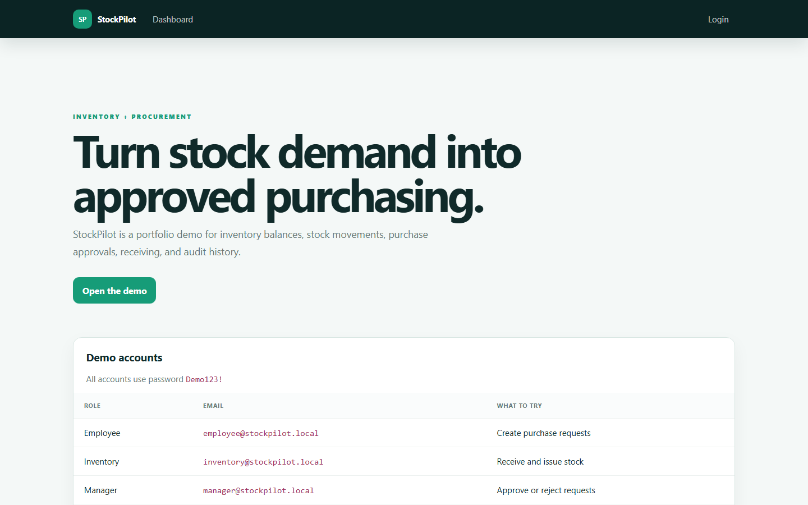

# StockPilot

StockPilot is an inventory and purchase requisition portfolio project. It demonstrates item masters, stock movements, role-based approvals, purchasing workflow, automatic receiving, and an audit trail with synthetic data only.



## Workflow

`Employee submits → Manager approves → Inventory orders → Inventory receives stock`

Receiving a purchase request automatically updates the item's on-hand quantity and records a stock movement.

## Demo accounts

All accounts use password `Demo123!`.

| Role | Email | Capability |
| --- | --- | --- |
| Employee | `employee@stockpilot.local` | Create and track purchase requests |
| Inventory | `inventory@stockpilot.local` | Maintain items, post stock movements, order and receive |
| Manager | `manager@stockpilot.local` | Approve or reject purchase requests |
| Admin | `admin@stockpilot.local` | Use every workflow |

## Run locally

Install the [.NET 10 SDK](https://dotnet.microsoft.com/download/dotnet/10.0), then run:

```bash
dotnet restore
dotnet run
```

Run the workflow check with:

```bash
dotnet run -- --self-check
```

## Technology

ASP.NET Core Razor Pages, ASP.NET Core Identity, Entity Framework Core, SQLite, and native CSS.

> Portfolio demo only. Before production use, replace `EnsureCreated` with migrations, remove demo credentials, use persistent storage, and configure secret management.
